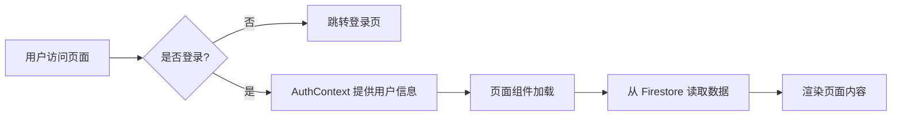
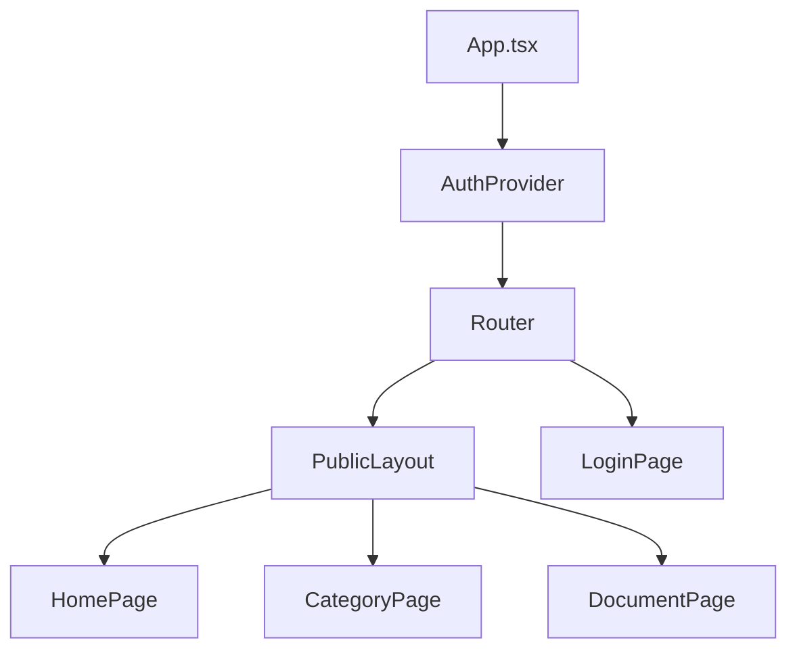

# NSSA 新闻简报系统 - 项目概览

## 📋 项目简介

这是一个基于 **Firebase** 的新闻简报系统，用于展示和管理每日新闻文档，并提供 **AI 语音播报功能**。系统采用前后端分离架构，前端使用 React + TypeScript + TailwindCSS 构建，后端使用 Firebase Cloud Functions + Google Cloud Text-to-Speech API 实现语音合成，数据存储在 Firestore 中，整个项目部署在 Firebase 平台上。

---

## 🏗️ 技术架构

### 前端技术栈

- **框架**: React 18.2 + TypeScript
- **构建工具**: Vite 5.0
- **路由**: React Router DOM 6.20
- **样式**: TailwindCSS 4.1 + PostCSS + 自定义 CSS
- **状态管理**: React Context API（用于身份验证）
- **Markdown 渲染**: React Markdown + Rehype/Remark 插件
- **音频播放**: HTML5 Audio API
- **图标**: Material Symbols Outlined
- **字体**: Inter（Google Fonts）

### 后端服务

- **数据库**: Firebase Firestore（NoSQL 文档数据库）
- **存储**: Firebase Storage（存储音频文件）
- **身份验证**: Firebase Authentication（邮箱密码登录）
- **云函数**: Firebase Cloud Functions（自动化 TTS 处理）
- **语音合成**: Google Cloud Text-to-Speech API（Long Audio API）
- **托管**: Firebase Hosting

### 开发工具

- **代码质量**: ESLint + Prettier
- **测试**: Vitest + Testing Library
- **本地开发**: Firebase Emulators

---

## 📁 项目结构

```
nssa_tech/
├── frontend/                    # 前端应用
│   ├── src/
│   │   ├── components/         # React 组件
│   │   │   ├── common/        # 通用组件（Button, AudioPlayer 等）
│   │   │   │   └── AudioPlayer.tsx # 语音播放器组件
│   │   │   └── layout/        # 布局组件（NavBar, Layout, Sidebar 等）
│   │   │       ├── Sidebar.tsx     # 侧边栏导航
│   │   │       ├── TopNavBar.tsx   # 顶部导航
│   │   │       └── PublicLayout.tsx # 公共布局
│   │   ├── pages/             # 页面组件
│   │   │   ├── HomePage.tsx   # 主页（每日简报 Dashboard）
│   │   │   ├── CategoryPage.tsx  # 分类列表页（侧边栏 + 分页加载）
│   │   │   ├── DocumentPage.tsx  # 文档详情页（含吸底音频播放）
│   │   │   ├── LoginPage.tsx     # 登录页
│   │   │   └── NotFoundPage.tsx  # 404 页面
│   │   ├── contexts/          # React Context
│   │   │   └── AuthContext.tsx   # 身份验证 Context
│   │   ├── config/            # 配置文件
│   │   │   └── firebase.ts       # Firebase 配置
│   │   ├── hooks/             # 自定义 Hooks
│   │   ├── utils/             # 工具函数
│   │   ├── types/             # TypeScript 类型定义
│   │   ├── styles/            # 全局样式
│   │   ├── App.tsx            # 应用主组件
│   │   └── main.tsx           # 应用入口
│   ├── index.html             # HTML 入口
│   ├── package.json           # 前端依赖
│   ├── vite.config.ts         # Vite 配置
│   ├── tailwind.config.js     # TailwindCSS 配置
│   └── tsconfig.json          # TypeScript 配置
├── functions/                 # Cloud Functions（后端）
│   ├── src/
│   │   └── index.ts           # TTS 处理函数
│   ├── package.json           # Functions 依赖
│   └── tsconfig.json          # TypeScript 配置
├── firebase.json              # Firebase 配置
├── firestore.rules            # Firestore 安全规则
├── storage.rules              # Storage 安全规则
├── firestore.indexes.json     # Firestore 索引配置
└── package.json               # 根项目配置
```

---

## 🔥 Firebase 配置

### 1. Firestore 数据库

系统使用三个主要的 Collection（集合）：
（配置保持不变，略）

---

## 🎯 核心功能模块

### 1. **身份验证系统** (`AuthContext.tsx`)

```typescript
// 提供的功能：
- user: 当前登录用户
- loading: 加载状态
- login(email, password): 登录方法
- logout(): 退出登录方法
```

### 2. **路由系统** (`App.tsx`)

系统路由结构：

```
公开路由：
  /login                                  登录页

受保护路由（需要登录）：
  /                                       主页（Dashboard）
  /:category                              分类文档列表
  /:category/:id                          文档详情

其他路径 → 重定向到 404
```

### 3. **主页 (Dashboard)** (`HomePage.tsx`)

**功能**：
- **每日简报 Dashboard**：根据时间显示个性化问候
- **分类概览**：显示 Business, Technology, Sports, Security 四大板块
- **视觉设计**：采用玻璃拟态 (Glassmorphism) 和渐变设计，体现现代杂志风格

### 4. **分类列表页 (Feed)** (`CategoryPage.tsx`)

**功能**：
- **双栏布局**：桌面端左侧 Sidebar 导航，右侧 Feed 流
- **分页加载**：基于 Firestore `startAfter` 和 `limit` 实现高效分页
- **宽卡片设计**：显示阅读时间预估、日期和摘要
- **移动端适配**：顶部滑动 Tab 栏

### 5. **文档详情页 (Reading)** (`DocumentPage.tsx`)

**功能**：
- **沉浸式阅读**：优化排版，衬线体标题 (Merriweather) + 无衬线正文 (Inter)
- **吸底音频播放器** (`AudioPlayer.tsx`)：
  - 支持播放/暂停、进度拖拽
  - **倍速播放**：支持 0.75x - 2.0x 变速
  - 玻璃拟态设计，不遮挡内容
- **Markdown 渲染**：完整支持代码高亮和目录


---

## 🎨 UI/UX 设计

### 主题系统

系统支持深色模式和浅色模式：

- **自动检测系统主题**（`prefers-color-scheme`）
- **主题持久化**（localStorage）
- **无闪烁切换**（FOUC 防护）
- **主题切换组件**（`ThemeToggle`）

### 设计特点

1. **现代化 UI**：
   - 圆角卡片设计（`rounded-2xl`）
   - 渐变色背景
   - 阴影和悬停效果
   - 平滑过渡动画

2. **响应式设计**：
   - 移动端优先
   - Grid 和 Flexbox 布局
   - TailwindCSS 断点系统

3. **无障碍访问**：
   - 语义化 HTML
   - ARIA 标签
   - 键盘导航支持
   - Skip Links

### 性能优化

1. **代码分割**：
   - 懒加载页面组件
   - 动态导入（`lazy()`）

2. **资源优化**：
   - 字体预加载
   - 图片懒加载工具（`imageOptimization.ts`）
   - 性能监控（`performanceMonitoring.ts`）

3. **缓存策略**：
   - 静态资源长期缓存（1年）
   - HTML 禁用缓存
   - Service Worker 支持

---

## 🔒 安全配置

### Firestore 规则

```javascript
// 读取需要身份验证
allow read: if isAuthenticated();
// 禁止前端写入
allow write: if false;
```

### Storage 规则

```javascript
// 公开可读
allow read: if true;
// 禁止前端写入
allow write: if false;
```

### HTTP 安全头

Firebase Hosting 配置了完善的安全头：

- `X-Content-Type-Options: nosniff`
- `X-Frame-Options: DENY`
- `X-XSS-Protection: 1; mode=block`
- `Cache-Control` 针对不同资源类型优化

---

## 🛠️ 开发工作流

### 本地开发

```bash
# 启动 Firebase Emulators
firebase emulators:start

# 启动前端开发服务器
npm --prefix frontend run dev
```

**Emulator 端口**：
- Firestore: 8088
- Storage: 9199
- Hosting: 5173
- Emulator UI: 4000

### 构建部署

```bash
# 构建前端
npm run build

# 部署到 Firebase
npm run deploy
# 或
firebase deploy --only hosting
```

**构建流程**：
1. TypeScript 编译
2. Vite 打包优化
3. 自动部署到 Firebase Hosting

### 代码质量

```bash
# 代码检查
npm run lint

# 代码格式化
npm run format

# 运行测试
npm test
```

---

## 📦 主要依赖

### 前端核心依赖

| 依赖 | 版本 | 用途 |
|------|------|------|
| react | ^18.2.0 | UI 框架 |
| react-router-dom | ^6.20.0 | 路由管理 |
| firebase | ^10.7.0 | Firebase SDK |
| react-markdown | ^10.1.0 | Markdown 渲染 |
| tailwindcss | ^4.1.16 | CSS 框架 |
| vite | ^5.0.0 | 构建工具 |
| typescript | ^5.0.0 | 类型检查 |

### 开发工具

| 依赖 | 版本 | 用途 |
|------|------|------|
| eslint | ^8.0.0 | 代码检查 |
| prettier | ^3.0.0 | 代码格式化 |
| vitest | ^1.0.0 | 单元测试 |
| @testing-library/react | ^16.3.0 | React 组件测试 |

---

## 🔄 数据流

### 数据读取流程



### 组件层级



---

## 🚀 部署架构

### Firebase 服务

```
┌─────────────────────────────────────┐
│     Firebase Hosting                │
│  (nssa-newsvoice.web.app)          │
│                                     │
│  ┌─────────────────────────────┐  │
│  │   React SPA (frontend/dist)  │  │
│  └─────────┬───────────────────┘  │
└────────────┼───────────────────────┘
             │
             ├──► Firebase Auth (身份验证)
             │
             ├──► Firestore (数据存储)
             │    ├─ business/
             │    ├─ technology/
             │    └─ sports/
             │
             └──► Firebase Storage (文件存储)
                  └─ documents/
```

---

## 📊 页面功能总结

| 页面 | 路径 | 功能 | 是否需要登录 |
|------|------|------|-------------|
| 登录页 | `/login` | 用户登录 | ❌ |
| 主页 | `/` | 显示三个分类卡片 | ✅ |
| 分类列表 | `/category/:category` | 显示该分类的文档列表 | ✅ |
| 文档详情 | `/category/:category/document/:id` | 显示文档完整内容 | ✅ |

---

## 🎯 核心特性

1. ✅ **用户身份验证**：Firebase Auth 邮箱密码登录
2. ✅ **数据隔离**：按分类（business/technology/sports）存储和展示
3. ✅ **Markdown 渲染**：完整的 Markdown 支持，包括代码高亮
4. ✅ **AI 语音播报**：Google Cloud TTS 自动生成高质量语音（新增）
5. ✅ **深色模式**：支持系统主题和手动切换
6. ✅ **响应式设计**：移动端和桌面端自适应
7. ✅ **代码分割**：按需加载页面组件
8. ✅ **本地开发**：Firebase Emulators 支持
9. ✅ **安全规则**：Firestore 和 Storage 安全控制
10. ✅ **性能优化**：缓存策略、懒加载、性能监控
11. ✅ **SEO 优化**：Meta 标签、语义化 HTML
12. ✅ **自动化处理**：Cloud Functions 自动触发 TTS 生成

---

## 💡 项目亮点

1. **完整的前端架构**：组件化、模块化、类型安全
2. **优秀的用户体验**：流畅动画、主题切换、加载状态
3. **专业的代码质量**：ESLint、Prettier、TypeScript、测试
4. **现代化的技术栈**：React 18、Vite、TailwindCSS 4
5. **完善的 Firebase 集成**：Auth、Firestore、Storage、Hosting、Cloud Functions
6. **AI 语音合成**：集成 Google Cloud TTS，自动生成高质量中文语音
7. **自动化工作流**：Cloud Functions 自动触发，无需手动干预
8. **性能优化**：代码分割、资源优化、缓存策略
9. **安全性**：严格的 Firestore 规则、HTTP 安全头
10. **可维护性**：清晰的项目结构、完整的 TypeScript 类型

---

## 🎵 语音播报功能说明

### **工作原理**

1. **数据准备**：在 Firestore 文档中添加 `voiceText` 字段（处理后的朗读文本）
2. **触发生成**：将文档的 `ttsStatus` 设置为 'PENDING'
3. **自动处理**：Cloud Functions 自动检测并调用 Google TTS API
4. **音频存储**：生成的 WAV 文件自动上传到 Firebase Storage
5. **前端播放**：用户访问文档时，自动加载并显示音频播放器

### **语音质量**

- **引擎**：Google Cloud Text-to-Speech（WaveNet 神经网络）
- **语音**：cmn-CN-Wavenet-A（中文女声，自然流畅）
- **采样率**：24000 Hz
- **格式**：WAV（LINEAR16）

### **成本控制**

- Google TTS 免费额度：每月前 100 万字符免费
- 音频文件缓存在 Storage，避免重复生成
- 按需生成，不会浪费资源
